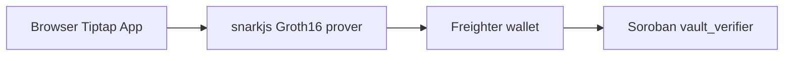

# Kaizenyard

Privacy-first productivity app with **Pages & Spaces** and **ZK Secure Vaults** on Stellar.

## Features

- **Pages & Spaces** — organize work in spaces with Tiptap page editing, templates, favorites, archive
- **Secure Vaults** — ZK-gated spaces: prove vault passphrase locally, verify unlock on Soroban testnet via Freighter
- Calendar, Kanban, Notes, Whiteboard (see [AGENTS.md](AGENTS.md))

## Getting Started

```bash
cp .env.example .env   # fill DATABASE_URL, Clerk, Liveblocks, etc.
npm install
npm run db:migrate
npm run dev
```

Open [http://localhost:3000](http://localhost:3000).

## Stellar Hacks: Real-World ZK

Submission for [Stellar Hacks: Real-World ZK](https://dorahacks.io/hackathon/stellar-hacks-zk/resources).

### Architecture



### ZK statement

Circuit `circuits/vault_unlock/vault_unlock.circom` (compile with `-p bls12381`):

| Input | Visibility | Meaning |
|-------|------------|---------|
| `secret` | private | Vault passphrase (field element) |
| `salt` | private | Salt + space label (field element) |
| `vault_id` | private | Space ID |
| `commitment` | public | `secret * salt` |
| `nullifier` | public | `secret + vault_id` (anti-replay) |

### Deployed contracts (testnet)

**Deployed for hackathon (2026-07-03):**

| Contract | Testnet ID |
|----------|------------|
| `vault_verifier` | `CDXXLKMEK5UXKG2CYLM6IHWTIBCFNNDYLGPQBSARQNUPG62JW3JACMUQ` |
| `agent_witness_verifier` | `CCKPLTS3WDKYRC2GHKDGOESRZI4OUIDZGCTYTEIOUIQKSJNHKQPAGBXF` |
| `app_share_verifier` | `CD3DAJRJG2XVA65GI3Y7Y3XCLRLYWY4PM5TNMWVCKCIZFT5SN5UOOZHK` |

Explorer: [vault](https://lab.stellar.org/r/testnet/contract/CDXXLKMEK5UXKG2CYLM6IHWTIBCFNNDYLGPQBSARQNUPG62JW3JACMUQ) · [witness](https://lab.stellar.org/r/testnet/contract/CCKPLTS3WDKYRC2GHKDGOESRZI4OUIDZGCTYTEIOUIQKSJNHKQPAGBXF) · [app share](https://lab.stellar.org/r/testnet/contract/CD3DAJRJG2XVA65GI3Y7Y3XCLRLYWY4PM5TNMWVCKCIZFT5SN5UOOZHK)

**No Stellar API key** — testnet uses public RPC (`https://soroban-testnet.stellar.org`) and Friendbot funding.

Full redeploy (all three contracts + ZK artifacts):

```bash
curl -fsSL https://github.com/stellar/stellar-cli/raw/main/install.sh | sh
rustup target add wasm32v1-none
chmod +x scripts/deploy-full-web3.sh
./scripts/deploy-full-web3.sh
```

Deploy only a missing contract:

```bash
./scripts/deploy-app-share.sh          # app_share_verifier only
./scripts/deploy-stellar-testnet.sh    # all three contracts
```

Set in `.env` (and **Vercel env** for production):

```
NEXT_PUBLIC_STELLAR_NETWORK=testnet
NEXT_PUBLIC_SOROBAN_RPC_URL=https://soroban-testnet.stellar.org
NEXT_PUBLIC_VAULT_VERIFIER_CONTRACT_ID=CDXXLKMEK5UXKG2CYLM6IHWTIBCFNNDYLGPQBSARQNUPG62JW3JACMUQ
NEXT_PUBLIC_AGENT_WITNESS_VERIFIER_CONTRACT_ID=CCKPLTS3WDKYRC2GHKDGOESRZI4OUIDZGCTYTEIOUIQKSJNHKQPAGBXF
NEXT_PUBLIC_APP_SHARE_VERIFIER_CONTRACT_ID=CD3DAJRJG2XVA65GI3Y7Y3XCLRLYWY4PM5TNMWVCKCIZFT5SN5UOOZHK
```

### Groth16 browser artifacts (built)

Artifacts are committed under `public/zk/` for Vercel static hosting:

```bash
chmod +x scripts/build-all-zk.sh
./scripts/build-all-zk.sh   # requires circom + snarkjs (npm install)
```

Outputs:

- `public/zk/vault_unlock.wasm`, `vault_unlock_final.zkey`
- `public/zk/app-share/app_share.wasm`, `app_share_final.zkey`

### Demo script (2–3 min)

1. Sign in → **Pages / Spaces**
2. **New Space** → enable **Secure Vault** → set passphrase
3. Connect **Freighter** (testnet) → create space
4. Open vault space → locked page titles (`••••••`)
5. **Unlock Vault** → enter passphrase → ZK proof generated locally
6. Sign Soroban tx → show explorer link → pages unlock
7. Create/edit page in Tiptap

### Limitations (honest)

- Dev Groth16 trusted setup (single contributor) — not production-ready
- Contract v1 validates public ZK outputs (commitment + nullifier replay guard); full on-chain Groth16 pairing verify is a future upgrade
- Secure vault sharing disabled in v1
- Testnet only

## Commands

```bash
npm run dev | build | lint
npm run db:generate | db:migrate | db:check
```

## License

Private — see repository owner.
