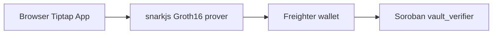

# Kaizenyard

Privacy-first productivity app with **Pages & Spaces** and **ZK Secure Vaults** on Stellar.

## Features

- **Pages & Spaces** — organize work in spaces with Tiptap page editing, templates, favorites, archive
- **Secure Vaults** — ZK-gated spaces: prove vault passphrase locally, verify unlock on Soroban testnet via Freighter
- Calendar, Kanban, Notes, Whiteboard (see [AGENTS.md](AGENTS.md))

## Getting Started

```bash
cp .env.example .env   # fill DATABASE_URL, Clerk, Liveblocks, etc.
npm install
npm run db:migrate
npm run dev
```

Open [http://localhost:3000](http://localhost:3000).

## Stellar Hacks: Real-World ZK

Submission for [Stellar Hacks: Real-World ZK](https://dorahacks.io/hackathon/stellar-hacks-zk/resources).

### Architecture



### ZK statement

Circuit `circuits/vault_unlock/vault_unlock.circom` (compile with `-p bls12381`):

| Input | Visibility | Meaning |
|-------|------------|---------|
| `secret` | private | Vault passphrase (field element) |
| `salt` | private | Salt + space label (field element) |
| `vault_id` | private | Space ID |
| `commitment` | public | `secret * salt` |
| `nullifier` | public | `secret + vault_id` (anti-replay) |

### Deploy vault verifier (testnet)

```bash
# Install Stellar CLI: https://developers.stellar.org/docs/tools/cli
cd contracts/vault_verifier
stellar contract build
stellar keys generate --global deployer --network testnet --fund
stellar contract deploy \
  --wasm target/wasm32-unknown-unknown/release/vault_verifier.wasm \
  --source deployer \
  --network testnet
```

Set `NEXT_PUBLIC_VAULT_VERIFIER_CONTRACT_ID` in `.env` to the deployed contract ID.

### Build ZK artifacts (optional full Groth16 browser prover)

```bash
chmod +x scripts/build-vault-zk.sh
./scripts/build-vault-zk.sh   # requires circom + snarkjs CLI
```

Outputs to `public/zk/` (`vault_unlock.wasm`, `vault_unlock_final.zkey`).

### Demo script (2–3 min)

1. Sign in → **Pages / Spaces**
2. **New Space** → enable **Secure Vault** → set passphrase
3. Connect **Freighter** (testnet) → create space
4. Open vault space → locked page titles (`••••••`)
5. **Unlock Vault** → enter passphrase → ZK proof generated locally
6. Sign Soroban tx → show explorer link → pages unlock
7. Create/edit page in Tiptap

### Limitations (honest)

- Dev Groth16 trusted setup (single contributor) — not production-ready
- Contract v1 validates public ZK outputs (commitment + nullifier replay guard); full Groth16 pairing verify can be wired when artifacts are deployed
- Secure vault sharing disabled in v1
- Testnet only

## Commands

```bash
npm run dev | build | lint
npm run db:generate | db:migrate | db:check
```

## License

Private — see repository owner.
